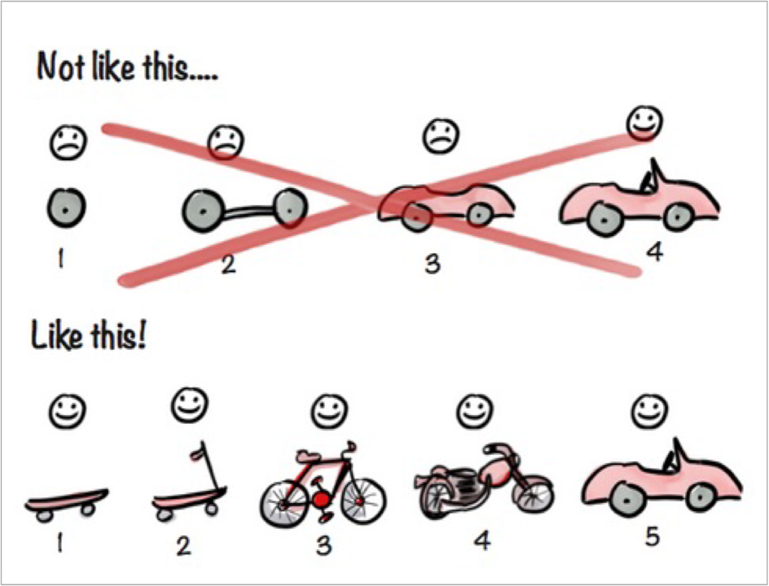

# Processus de webdesign

## Moodboard et style tile

## Zoning et wireframe

## Découper son projet et définir des itérations

Le découpage du projet en itérations permet de définir des jalons et de prioriser les fonctionnalités à développer. On appelle MVP (Minimum Viable Product) la première version du produit qui contient les fonctionnalités essentielles. On garde en tête cette philosophie à chaque étape du projet, pour fournir au client un produit fonctionnel le plus rapidement possible.

