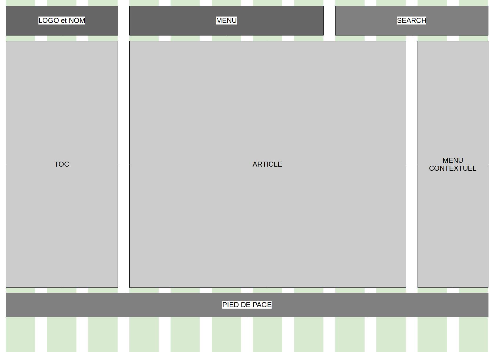
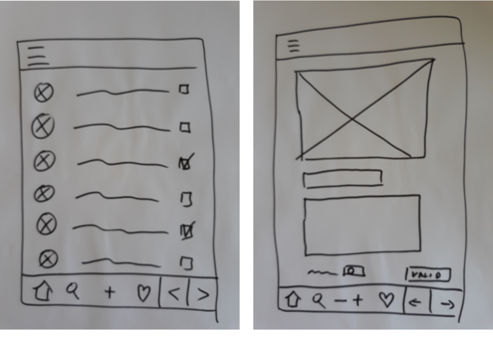
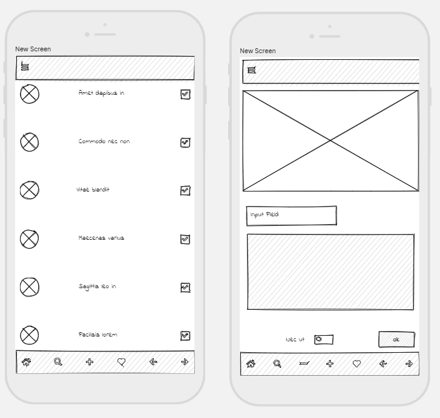
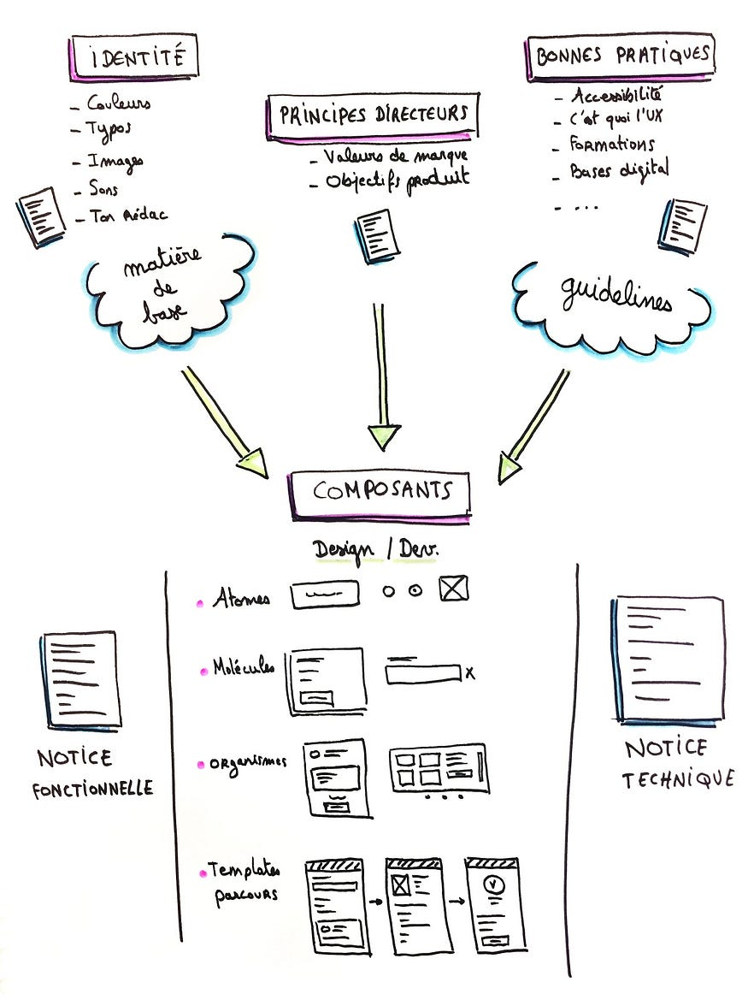

# La maquette

## Les étapes

Pour réaliser une belle maquette, il faut obligatoirement passer par plusieurs étapes. La première étape est peu précise et rapide à réaliser, la dernière est tout le contraire.
N'oubliez pas que dessiner une maquette est avant tout construire une interface fonctionnelle pour l'utilisateur. Ne vous laissez pas distraire par la forme (le bling-bling) dès le début, vous allez perdre beaucoup de temps et vous risquez de passez à côté de la question essentielle : A quoi sert mon écran ?
Privilégiez donc l'ergonomie au graphisme.
Aussi il est impératif de mettre le client dans la boucle dès le début et de bien lui expliquer ces différentes étapes.

## Le zoning

Le zoning est la première étape. Nous allons découper notre écran en blocs (ou boîtes) vides.
Il s'agit d'une mise en page grossière sans esthétique. Les proportions ne sont pas nécessairement respectées. Très peu d'informations apparaissent. Graphiquement, nous sommes dans une fidélité basse.
Le but est de montrer les grandes fonctionnalités et les principales zones du site.
Travaillez uniquement en nuances de gris : une pour indiquer les blocs présents sur toutes les pages et une autre pour le spécifique à la page. Vous pouvez ajouter d'autres nuances, mais en aucun de la couleur.

Vous allez dessiner des pages, mais pour quelle largeur et quelle hauteur d'écrans ?
Vous faites un site responsive, adaptatif, pour un écran particulier, pour plusieurs écrans ?
Ce sont des questions aux quelles vous devez répondre avant de vous lancer dans le dessin.

Un site responsive est un site web qui a une seule url et donc affiche les mêmes données. Par contre la disposition des zones sera différente selon la taille des écrans, voir nous déciderons de la disparition visuelle de certaines informations si l'écran est trop petit.
De nos jours, les utilisateurs consomment de plus en plus de portable et donc souvent, nous devons concevoir l'application d'abord pour le mobile puis la tablette et enfin l'ordinateur. Cependant, si vous écrivez une application qui sera principalement utilisée sur ordinateur, vous dessinerez d'abord sur le grand écran.

Une application adaptative est une application qui affiche des informations différentes selon l'écran, et donc demande du développement spécifique. Il faut donc choisir les écrans sur les quels on voudra que notre application fonctionne. On ne pourra pas tous les faire. Une application adaptative demande beaucoup plus d'énergie.

Parfois, vous ferez une application que pour un seul écran, un ordinateur par exemple. Cette situation est de plus en plus rare dans la vie d'un développeur.

Prenez connaissance du [Responsive Web Design](https://fr.wikipedia.org/wiki/Site_web_r%C3%A9actif) et du Mobile First design et de l'Adaptive Design avant de vous lancez dans le design.

Quand nous dessinons les zoning, le dessin doit être rapide et peu précis. Il est inutile d'utiliser un logiciel compliqué. Le zoning ci-dessous est réalisé sous LibreOffice Draw.

Vous avez dû remarquer les colonnes vertes en arrière plan. En fait, je sais que développerai un site web responsive que que j'utiliserai le framework Bootstrap. J'ai donc dessiné les 12 colonnes avec les gouttières, comme cela je vais gagner un peu de temps lors du développement. Vous pouvez télécharger ce zoning pour bootstrap.

## Le wireframe

Le wireframe est la maquette fil de fer qui vient compléter le zoning. Chaque bloc s'enrichit des éléments qui le composent : texte, image, zone de saisie, bouton, etc... On ne travaille pas l'aspect visuel : ni la taille, ni la couleur, ni l'alignement. Graphiquement nous sommes sur une fidélité moyenne.
On définit l'organisation des éléments, et donc le placement des éléments est important.
Graphiquement, nous sommes dans une fidélité moyenne.
C'est sur le wireframe que vous tomberez dans le piège du joli. Un wireframe élaboré avec de belles photos, des couleurs, un style, nous détourne de l'ergonomie et des fonctionnalités.
Un wireframe répond à la question : A quoi sert cet écran ? Souvent nous retrouvons des wireframes monochrome du style écrit à la main.

Voici deux écrans dessinés à la main :

Et voici le résultat une fois scannés et importé dans le logiciel uizard. Nous avons apporté quelques retouches :

## Le mockup

Le mockup est dynamique est navigable.
A ce moment nous pouvons transformer le wireframe en reproduction fidèle, en ajoutant des photos, des feuilles de style. Nous alignons les éléments de l'écran. Nous ajoutons des actions sur les éléments, nous naviguons entre les pages. Il permet de se projeter davantage.
Graphiquement, nous sommes dans une fidélité haute.
Voici le résultat des deux écrans précédents : Ces deux écrans transformés en mockup grâce au logiciel uizard

## Le prototype

Le prototype devient fonctionnel. Les tests sont poussés plus avant. C'est le prototype qui est mis en avant pour vendre le produit aux investisseurs.
le prototype n'est pas destiné au développeur, et donc nous ne développerons pas ce sujet.

## Compléments

### Le design system

Pour uniformiser le visuel de l'application, durant de nombreuses années, nous avons utiliser la charte graphique qui est très rigide. Aujourd'hui, avec les outils modernes de conception et l'Agility, nous parlons de Design System. Ce concept a été développé par un Web Designer Prad Frost. Ce concept est utilisé dans les outils modernes comme Figma.

Sketchnote tiré du [billet Medium](https://audreyhacq.medium.com/tout-savoir-sur-les-syst%C3%A8mes-de-design-1b6400c9a1b3) d'Audrey Hacq.

Je vous conseille la lecture de cet article pour bien comprendre ce concept. Et voici la version écrite par l'auteur Atomic Design by Brad Frost.

### Quelques notions UI

Le design UI est un métier à part entière qui demande une formation plus longue que la lecture de quelques articles.
Dans ce chapitre, nous n'abordons que quelques notions qui nous permettent de dessiner une interface qui n'aura pas le look d'une application des années 2000. Voici quelques articles :

- Skeuomorphisme, Flat design, Material Design. Ces termes ne signifient rien pour vous, lisez ces 4 premiers chapitres du cours sur OpenClassroom.
- Tout comprendre de l’ui design
- Une tendance UI de l'année 2021
