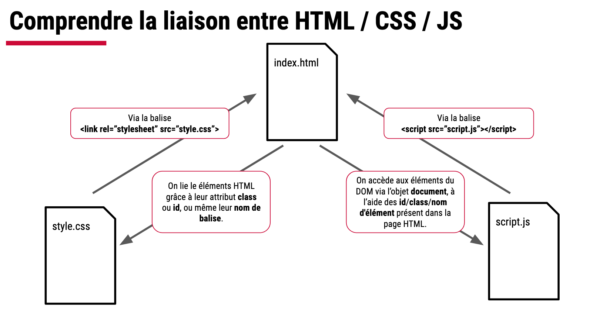

# DOM

## Affichage de l'heure

Dans une page HTML :

- Ajouter une paragraphe contenant le texte : "00:00:00"

Au chargement de la page HTML, en JS :

- Générer l'heure au format HH:MM:SS
- Help pour générer l'heure : `new Date().toLocaleTimeString("fr")`
- Modifier le texte du paragraphe avec cette heure
- Faire en sorte que l'heure se mette à jour automatiquement toute les secondes
- Help pour la mise à jour automatique : il faut utiliser setInterval

**Contrainte :** Afficher l'heure en rouge et gras si les secondes sont multiples de 3 à l’aide d’une classe CSS

## Guess the number

- Générer un nombre aléatoire entre 0 et 100
- Demander à l'utilisateur de le trouver
- Help :
  `let prenom = prompt('Quel est ton prénom ? ')`
- Indiquer à l'utilisateur si c'est plus ou moins
- Indiquer si l'utilisateur à trouvé la bonne réponse

**Bonus :** lorsque l'utilisateur a trouvé, lui indiquer le nombre d'essais effectués et le temps écoulé.
